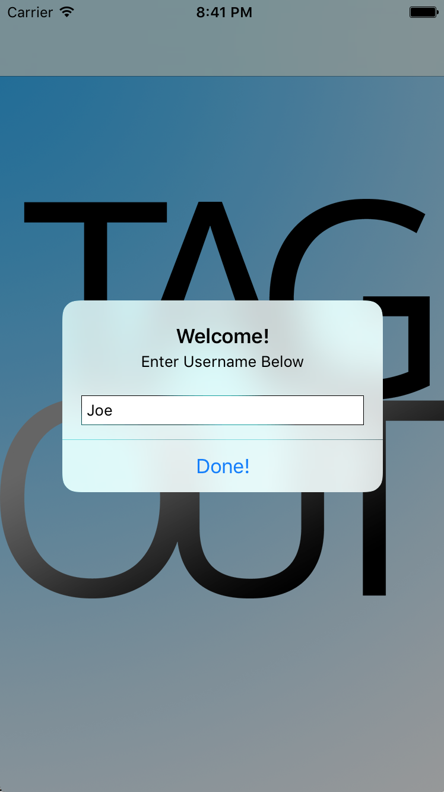
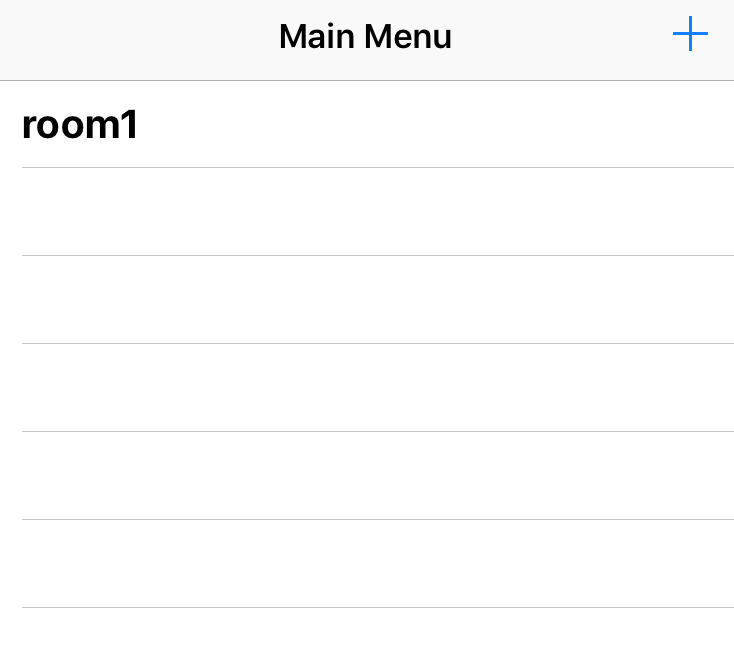
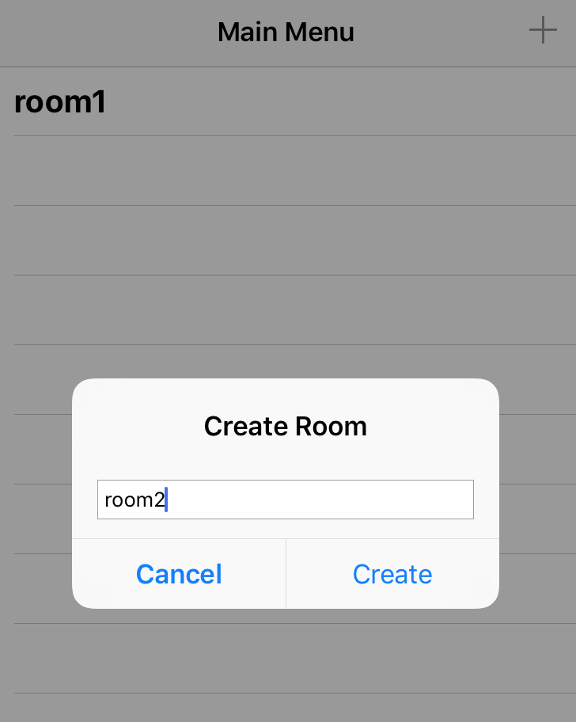
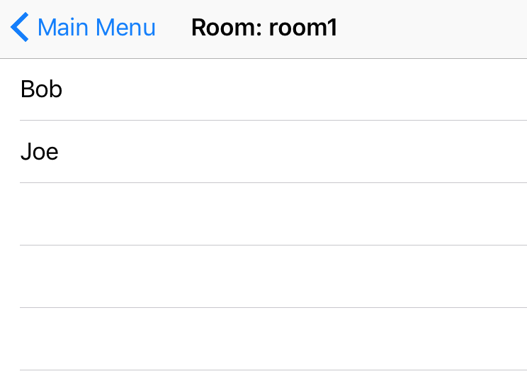
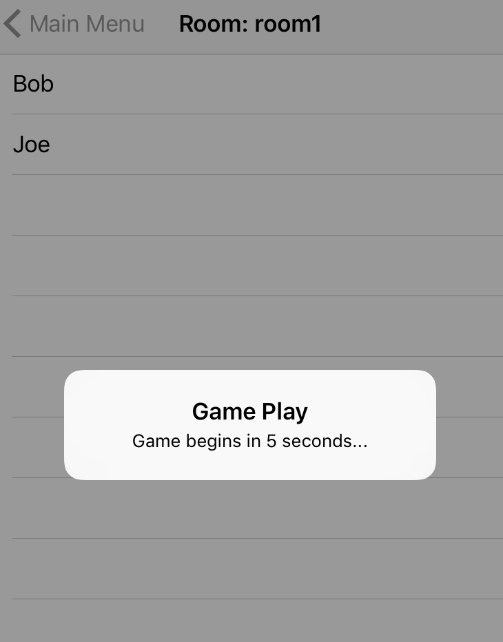
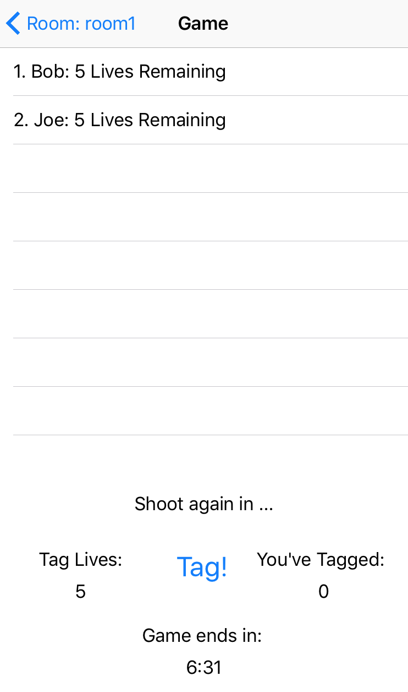

## TagOut

**What is it?**

TagOut is a peer-to-peer game that allows users to "tag" each other, that is, when you point your phone at them and shoot, you gain a point, and they lose a tag life! The goal of the game to Tag the most people and avoid being shot at.

**The Rundown**

When you open the app, you will be prompted to enter you user name. 

 

After that, you will be redirected to the Main Menu. In here, you will see all the rooms open on the WiFi network.
Unfortunately, sometimes rooms do not appear on launch and on connection to the other person. To fix this problem, the player hosting the room must exit and create a new room. Only then will the room be shown.

 

Click on the blue arrow on the top right corner to create a new room. In here you will write down your room name, and then you will be redirected to a new room. Since you will be the only one in the room, you will become the administrator and will have access to start the game if at least 1 more person joins the room.

 

You can always enter and re-enter rooms as long as the game has not been started. 

 

As soon as the game begins, you will be locked into that room until the game starts and then you can leave.

 

Here are your controls for the game. Point the phone at a player, and press shoot! Since the horizontal accuracy is unfortunately limited to 5 meters of precision, be prepared to play at somewhat of a distance. When you accurately point at a person and press "Tag!", the person will lose a Tag Life point and you will gain a Tag point. You may only tag once every 3 seconds. The scoreboard will get updated in real time based on the points accrued for every person. The person with the most points wins!

 

Enjoy!
